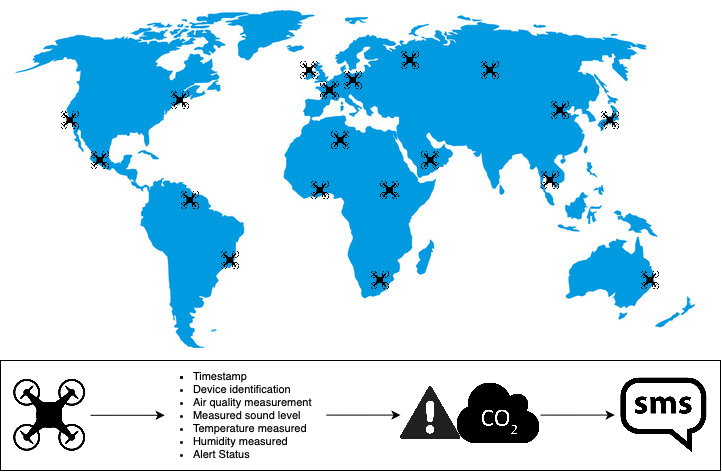

# Data Engineering Project

## Video Presentation

## Requirements

### Situation

We start with a startup idea for an innovative service based on:

- IoT devices
- An information system

IoT devices are crucial as they must emit data every few minutes (or seconds). If your startup is successful, there will be millions of these devices. We assume you have managed to create a working prototype, regardless of what your devices do.

Every piece of data emitted by the devices must include: timestamps, device ID, latitude and longitude, and any other fields you find useful.

Your information system must provide:

- An urgent service referred to as "alert".
- A long-term analytics service.

### Project

It’s your responsibility to report and recommend the right architecture.

Based on preliminary questions, your solution will likely include:

- At least one distributed storage system
- At least one distributed stream
- At least two stream consumers

### Programming Constraints

- No dependency is allowed to parse CSV.
- You must not use the following keywords: `catch`, `var`, `for`, `return`, `.get from Option type`, `null`, `throw`, `head` (unless in optional parts with permission).
- You must not use a `foreach` inside another `foreach`.
- If you choose not to use a database, you are allowed to use mutable collection(s) instead, solely to replace a database.

### Preliminary Questions

- What technical/business constraints should the data storage component of the program architecture meet to fulfill the requirements described in the "Statistics" paragraph? What kind of component(s) will the architecture need?
- What business constraint should the architecture meet to fulfill the requirement described in the "Alert" paragraph? Which component to choose?

## Chosen Topic

### Context

Creation of an innovative environmental monitoring service. The goal is to deploy IoT sensors in various capitals (Paris, London, Tokyo, New York, Moscow, Beijing, Sydney, Berlin, Mexico City, Los Angeles) to collect data on air quality, noise levels, temperature, humidity, etc. This data is used both to issue real-time alerts when critical thresholds are exceeded and to analyze long-term environmental trends for urban planning and ecological awareness.

### Data Collected by the Sensors

- **Timestamps**: Date and time of the measurement.
- **Device ID**: Unique identifier of the sensor.
- **Latitude and Longitude**: Location of the sensor.
- **Air Quality**: Concentrations of CO2, fine particles, etc.
- **Noise Levels**: Recorded decibels.
- **Temperature and Humidity**: Climate measurements.

### System Architecture

